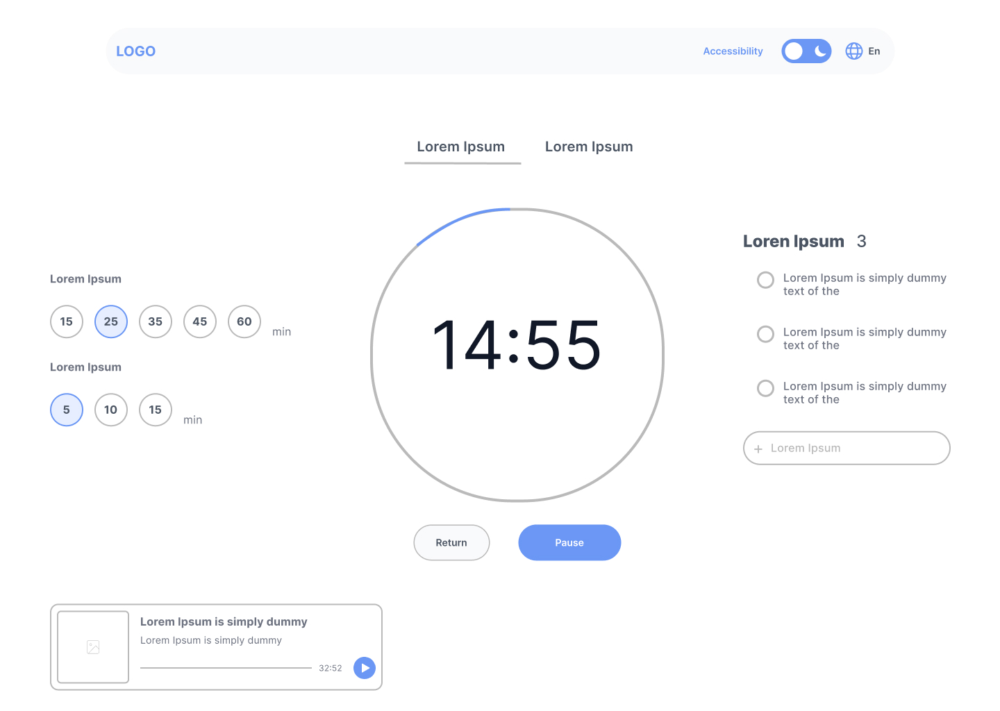

# Desafio da DIO - Wireframe de um Website de Gerenciamento de Tempo

## Sobre a proposta: 

O Focus Timer é uma interface de timer desenvolvida com o objetivo de
auxiliar o usuário na organização de períodos de foco e descanso.

O projeto foi desenvolvido inicialmente no Figma, com foco na criação
da interface, hierarquia visual, organização dos elementos e experiência
do usuário, além de exercitar conceitos e heurísticas de UI.

## Design

O projeto foi desenvolvido utilizando o Figma.

## 🔗 Protótipo

[👉 Acessar projeto no Figma](https://www.figma.com/design/wPgGzooyfjkho2f8rIGu9U/PUNKDORO?node-id=20-82&t=tCDT5mi08N1WJ8Rs-1)

### Tela do timer

## Objetivo

O objetivo do projeto é criar uma interface simples e intuitiva para
configuração e acompanhamento de sessões de foco.

## Heurísticas de Nielsen

Durante o desenvolvimento da interface, foram consideradas as 10 heurísticas de
usabilidade de Jakob Nielsen. Dentre elas, algumas possuem maior relação com as
funcionalidades e decisões de design presentes no projeto.

### 1. Visibilidade do status do sistema

A interface mantém o usuário informado sobre o estado atual da sessão por meio
do contador regressivo e do círculo de progresso. Dessa forma, o usuário consegue
acompanhar visualmente o andamento do timer e identificar quanto tempo resta.

Além disso, a duração selecionada é destacada visualmente, permitindo identificar
qual opção está ativa.

### 2. Correspondência entre o sistema e o mundo real

O sistema utiliza conceitos familiares ao usuário, como minutos e contagem
regressiva, facilitando a compreensão do funcionamento do timer.

As opções de duração são apresentadas em unidades de tempo conhecidas, como
5, 10, 15, 25, 35, 45 e 60 minutos.

### 3. Controle e liberdade do usuário

O usuário possui controle sobre a sessão por meio dos botões de interação.

O botão **Pause** permite interromper temporariamente o timer, enquanto o botão
**Return** permite retornar à tela anterior. Essas opções dão ao usuário maior
liberdade para controlar sua interação com o sistema.

### 4. Consistência e padrões

Os elementos da interface seguem padrões visuais consistentes, utilizando
estilos semelhantes para elementos que possuem funções relacionadas.

Também existe uma diferenciação visual entre ações primárias e secundárias:
o botão **Pause** utiliza preenchimento azul para receber maior destaque,
enquanto o botão **Return** utiliza uma aparência mais discreta.

### 5. Reconhecimento em vez de memorização

As opções de duração do timer são apresentadas diretamente na interface,
permitindo que o usuário escolha uma duração sem precisar memorizar ou inserir
manualmente um valor.

Da mesma forma, as tarefas associadas à sessão permanecem visíveis na interface,
facilitando seu reconhecimento.

### 6. Estética e design minimalista

A interface utiliza uma composição visual simples, priorizando as informações
mais importantes para a atividade: o tempo restante, a duração selecionada e
os controles do timer.

A redução de elementos desnecessários contribui para uma experiência mais
limpa e adequada a uma ferramenta voltada para foco e produtividade.

## Resumo das heurísticas aplicadas

| Heurística | Aplicação no projeto |
|---|---|
| Visibilidade do status do sistema | Contador regressivo, círculo de progresso e indicação da duração selecionada |
| Correspondência com o mundo real | Uso de minutos e contagem regressiva |
| Controle e liberdade | Botões Pause e Return |
| Consistência e padrões | Padrões visuais e diferenciação entre ações primárias e secundárias |
| Reconhecimento em vez de memorização | Opções de duração e tarefas visíveis |
| Estética e design minimalista | Interface limpa e foco nas informações principais |

## Tecnologias e ferramentas

- Figma
- GitHub

## Projeto

O projeto foi desenvolvido como parte de um exercício proposto pela Formação UX/UI da DIO.

